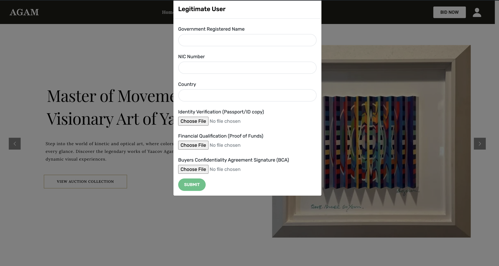

# SAVE LEGIMATE USERS

## Admin side SS

## Client Side SS

## Description

Once a user register to the system this plugin helps to validate that user. Once user logged to the system this plugin again and again (like after every 10seconds) run and ask the details like NIC/Passport and so on. Once the user filled those it will note in the ADMIN and the SHOP MANAGER's side. They can deside whether this user is legimate or not and get the nessasary action accordingly.
